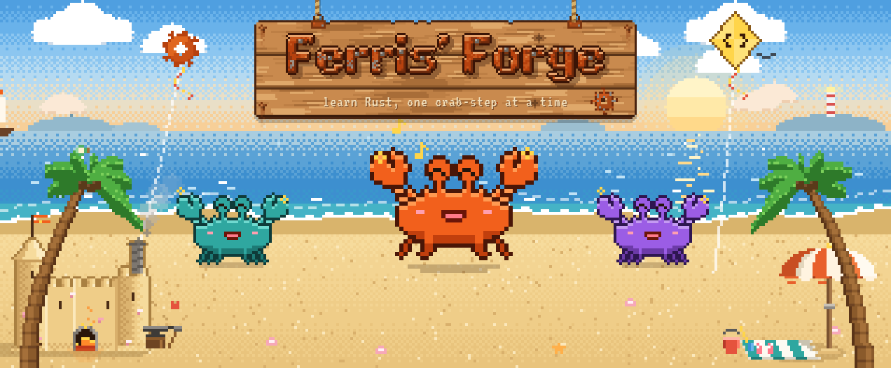
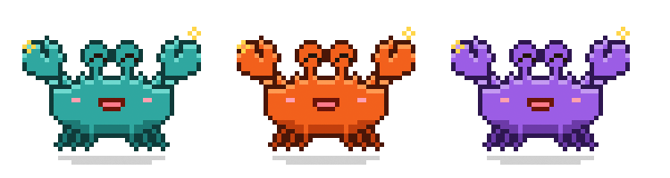
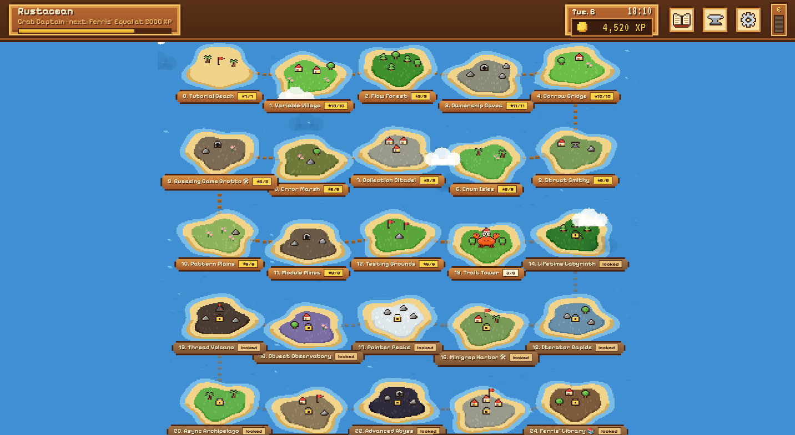
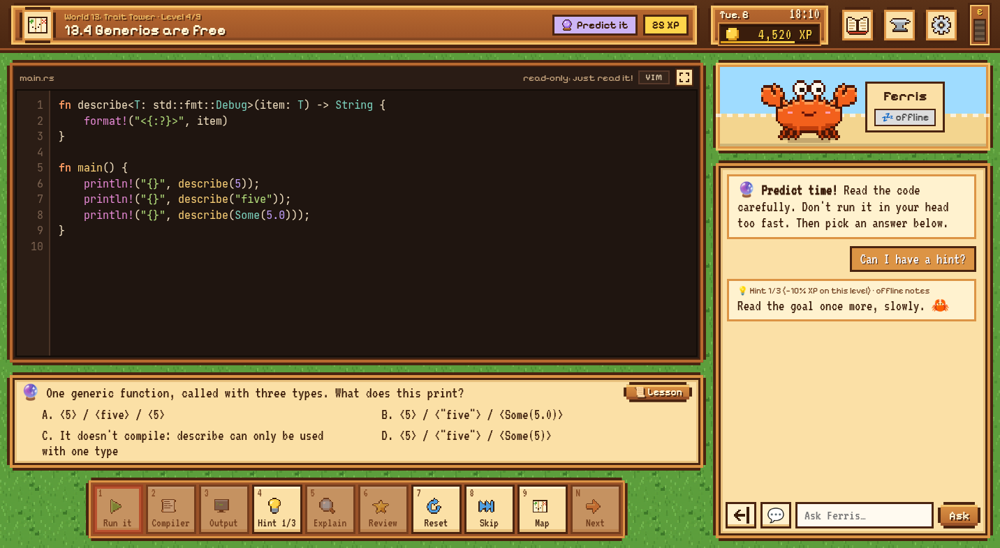
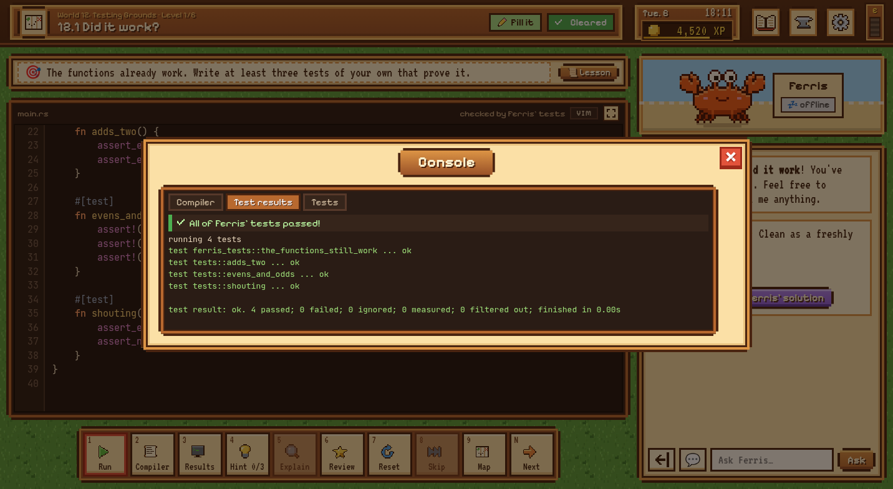
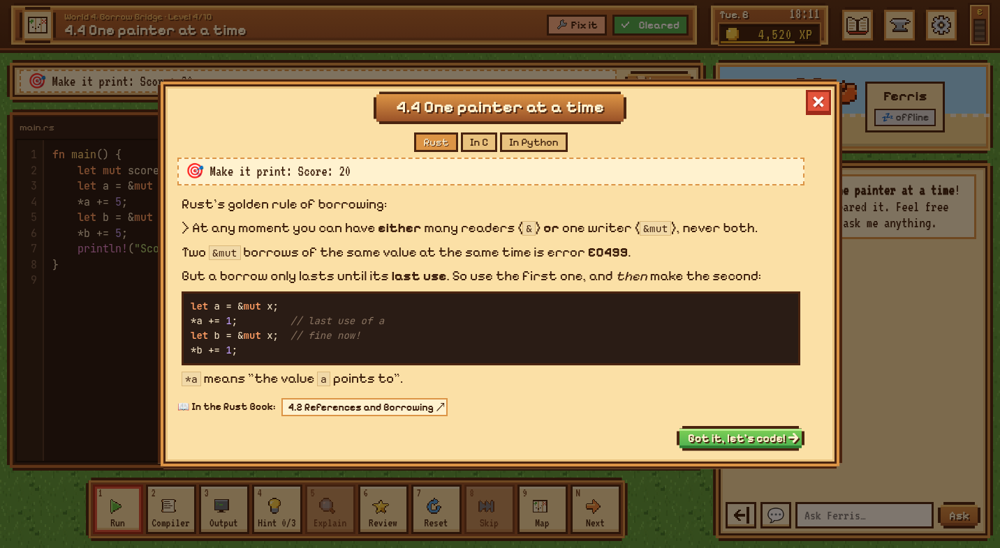
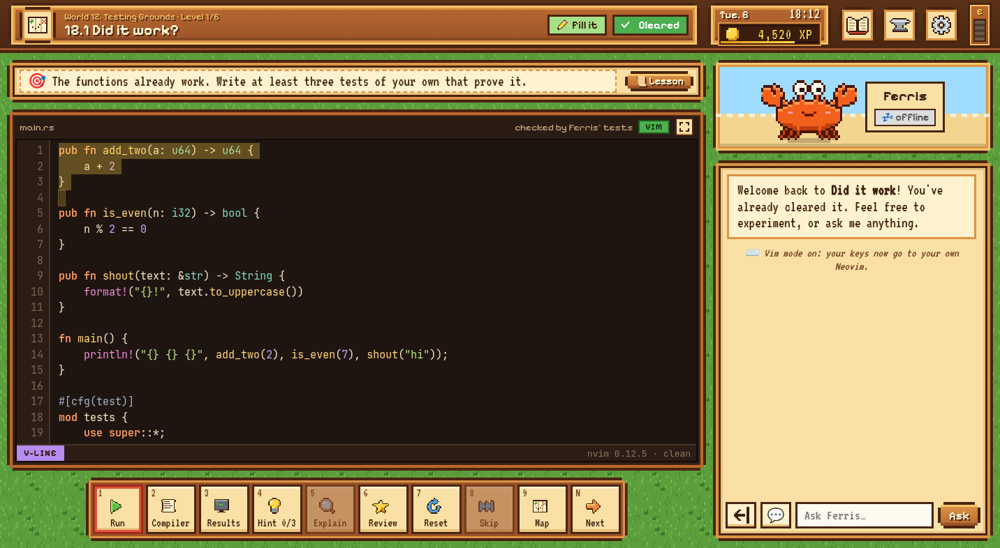
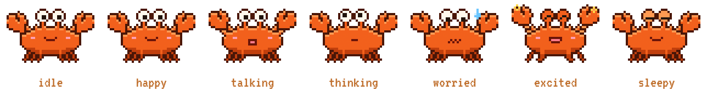
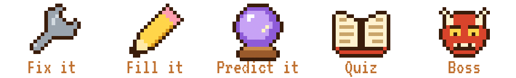

<p align="center">
  
</p>

<h1 align="center">Ferris' Forge</h1>

<p align="center">
  <b>A cozy pixel-art game that teaches Rust from the ground up.</b><br>
  25 islands · 187 levels · the whole Rust Book · a real compiler · and Ferris the crab as your teacher, powered by Claude.
</p>

<p align="center">
  
</p>

## Play

You need [Rust](https://rustup.rs) (the game compiles your code with your own `rustc`). For Ferris to talk, you also need [Claude Code](https://claude.com/claude-code); without it, switch Ferris to offline mode in Settings and he gives built-in hints. [Neovim](https://neovim.io) is optional, for Vim mode.

```bash
git clone https://github.com/wanikhawar/ferris-forge
cd ferris-forge
cargo run
```

Your browser opens the game at http://127.0.0.1:7878. Press Ctrl+C in the terminal to quit.

The link the game opens (and prints in the terminal) ends in `#key=…`. The game runs Rust code and Neovim for whoever uses its API, so the API only answers pages that have this key; other programs and other users on your computer can't. Your browser remembers it, so later you can just open http://127.0.0.1:7878. In a new browser or a private window, use the printed link once. The key is kept in `save/game.key`, readable only by you; delete that file to make a new one.

Developed and tested on Linux.

## A look around

<table>
  <tr>
    <td width="50%"><br><b>The world map.</b> 25 islands, each a part of the Rust Book. Clear an island's boss to unlock the next.</td>
    <td width="50%"><br><b>A level.</b> Code on the left, Ferris on the right. Hints, explanations and code reviews come from Ferris.</td>
  </tr>
  <tr>
    <td width="50%"><br><b>Real results.</b> Your code is compiled and run with <code>rustc</code>, and checked by its output or by Ferris' tests.</td>
    <td width="50%"><br><b>Lessons.</b> A short lesson for every level, with how it compares to C and Python, and a link to the book.</td>
  </tr>
  <tr>
    <td width="50%"><br><b>Vim mode.</b> Edit with your own Neovim and your own config, running invisibly behind the editor.</td>
    <td width="50%" align="center"><br><b>Ferris has moods.</b> He thinks while you compile, worries when it breaks, and dances when it works.</td>
  </tr>
</table>

## How it works

- **Real compiler.** Your code is compiled and run with your own `rustc`. The compiler and tests decide whether you pass a level, not the AI.
- **Ferris = Claude.** Explanations, hints, code reviews and chat go through `claude -p` (Claude Code's headless mode), so they use your Claude subscription. There's no API key. Ferris has no tools in the game: he can only talk.
- **Switch models** with the 🧠 chip under Ferris (Fable, Opus, Sonnet, Haiku, or any model name Claude Code accepts) and pick an effort level.
- **The ⚡ "E" bar** in the top-right corner shows how much of your Claude usage limit is left. It updates after Ferris answers.
- **Offline mode** (in Settings) uses built-in hints and doesn't touch your Claude limit.

## Level types

<p align="center">
  
</p>

🔧 **Fix it**: broken code to repair · ✍️ **Fill it**: write the missing part · 🔮 **Predict it**: guess the output · 📖 **Quiz**: a concept question · 👹 **Boss**: a mini-project at the end of each world.

Levels can also give your program keyboard input, command-line arguments, environment variables and extra files (see the `stdin`, `args`, `env` and `files` fields in the level TOML).

Hints cost XP on that level (−10%, −30%, then −60% for the full answer). If Ferris' code review says your passing code is idiomatic, you get +15 bonus XP.

## Vim mode

Click **VIM** above the editor (or turn it on in Settings) and every keystroke goes to your own Neovim, running invisibly in the background (`nvim --embed`). Motions, operators, text objects, registers, macros, `:s`, undo and your keymaps all work. The status line under the code shows the mode and your `:` commands.

- By default it loads your config (`~/.config/nvim`). Settings can switch to a clean Neovim instead.
- It never writes files: the buffer is a scratch buffer, and the game saves your code itself.
- Use **Ctrl+Shift+C / Ctrl+Shift+V** for the system clipboard. Some browser shortcuts (like Ctrl+W) can't be captured by a web page.

## Controls

| Key | Action |
|---|---|
| Ctrl+Enter | Run your code |
| 1–9, N | Hotbar: Run, Compiler, Output/Results (with the Expected or Tests tab), Hint, Explain, Review, Reset, Skip, Map, Next |
| A–D | Answer a predict question |
| Tab / Shift+Tab | Indent / dedent |
| Ctrl+/ | Toggle comment (when Vim mode is off) |
| L | Open the lesson |
| Q | Quick questions for Ferris |

<p align="center"></p>

## The islands

The curriculum follows **The Rust Programming Language**, using Brown University's interactive edition (https://rust-book.cs.brown.edu). The 25 islands cover the whole book, ordered by what you need to know first rather than by chapter number. `levels/book.toml` lists every chapter and section; each level says which sections it teaches, and the lesson popup links straight to them.

| # | Island | Book |
|---|---|---|
| 0 | Tutorial Beach | Ch 1, 3.4 |
| 1 | Variable Village | 3.1–3.2 |
| 2 | Flow Forest | 3.3, 3.5 |
| 3 | Ownership Caves | 4.1 |
| 4 | Borrow Bridge | 4.2–4.5 (incl. the permissions model, fixing ownership errors) |
| 5 | Struct Smithy | Ch 5 |
| 6 | Enum Isles | Ch 6 (+ Ownership Inventory #1) |
| 7 | Collection Citadel | Ch 8 (+ Inventory #2) |
| 8 | Error Marsh | Ch 9 |
| 9 | Guessing Game Grotto 🛠 | Ch 2 (project) |
| 10 | Pattern Plains | Ch 19 |
| 11 | Module Mines | Ch 7 |
| 12 | Testing Grounds | Ch 11 |
| 13 | Trait Tower | 10.1–10.2, App. C |
| 14 | Lifetime Labyrinth | 10.3 (+ Inventory #3) |
| 15 | Iterator Rapids | 13.1, 13.2, 13.4 |
| 16 | Minigrep Harbor 🛠 | Ch 12, 13.3 (project) |
| 17 | Pointer Peaks | Ch 15 |
| 18 | Object Observatory | Ch 18 (+ Inventory #4) |
| 19 | Thread Volcano | Ch 16 |
| 20 | Async Archipelago | Ch 17 |
| 21 | Cargo Docks | Ch 14 |
| 22 | Advanced Abyss | Ch 20 |
| 23 | Web Server Citadel 🛠 | Ch 21 (final project) |
| 24 | Ferris' Library 📚 | Appendices |

Levels are compiled with plain `rustc`, so they can't use crates. The Async Archipelago levels therefore come with `runtime.rs`, a tiny async runtime built from the standard library (block_on, sleep, join, race, channels and streams) that stands in for tokio or the book's `trpl`. The Web Server Citadel tests act as browsers over real TCP connections on 127.0.0.1.

## Project layout

```
src/        Rust backend (axum): runner (rustc), teacher (claude -p), Vim bridge, progress, API
levels/     the curriculum: one TOML file per world, plus book.toml (the book's contents)
web/        the pixel UI (plain HTML/CSS/JS, no build step)
docs/       the README's images; docs/art/make-art.html redraws its artwork
save/       your progress (created on first run)
```

To check that every level is solvable (each starter fails, each solution passes, each predict answer is correct):

```bash
cargo run -- verify      # every world
cargo run -- verify 5    # just world 5
```

`cargo run -- verify` also checks **coverage**: every book topic must be taught by at least one level, and every section id a level mentions must exist.

## Safety

The game runs on your own computer and only listens on 127.0.0.1. It runs the code you write (as you, like `cargo run` would), so be as careful with code pasted from elsewhere as you would be in a terminal.

- Only the game's own page can use its API (see the key above); other websites and other local programs can't.
- Each program runs with limits on memory, file size and CPU time, and is stopped after 5 seconds. On Linux it runs in its own process namespace, so nothing it starts outlives the run.
